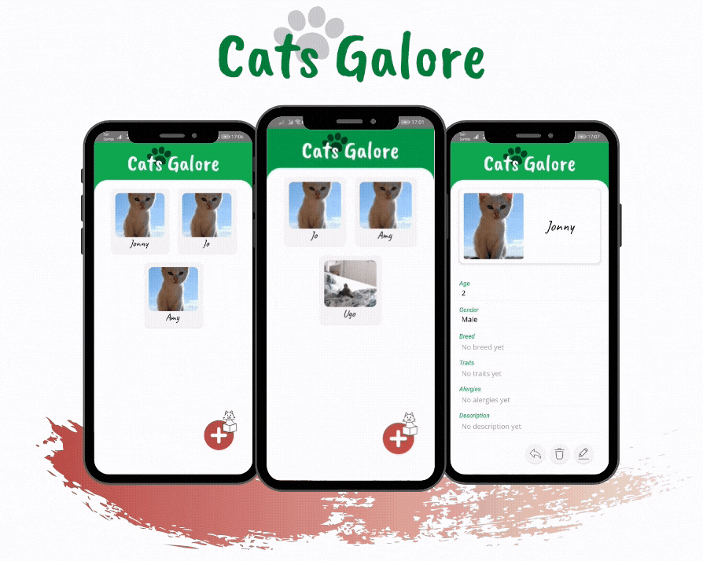

# Cats Galore
Cats Galore is an app that lets you keep track of all your cats :smiley_cat:, and other animals you might have!

Due to my current OS, for the moment, it's an Android App. This project was built with [React Native](https://reactnative.dev/) and just a couple of npm packages. I used [Redux](https://redux.js.org/) for state management and [Redux Persist](https://github.com/rt2zz/redux-persist) with [Async Storage](https://react-native-community.github.io/async-storage/) as a data storage solution.



# The Challenge
:heavy_check_mark: Show all cats.     
:heavy_check_mark: Add new cats.  
:heavy_check_mark: Edit cat details.  
:heavy_check_mark: Delete cats from the list.  

# Try It Yourself
To run this app on your device or simulator you need to make sure your environment is correctly set up and ready to go. [Check here](https://reactnative.dev/docs/environment-setup) for how to do it.  
If you have any experience developing with React Native, chances are that your environment is alrady configured, lucky you!
In any case, once your environment is ready:  
- clone this repo,
- install the dependencies with ```npm i```,
- and then run ```npm run android``` to see the magic happen :tada:.

Voilà! :rocket:

# Observations & Lessons Learned
- There is a placeholder image for your cat (in case you are lazy), but your cat deserves to have its real face shown :smiley_cat:: use an image from your phone's library or take one on the spot.
- I would make more elements of the design in variables, which would lead to a more maintainable and modular style. I would also try to keep the style-sheet out of the components or use styled components.
- I'm happy with the reusability of the components, there is some repetition in the code but that is mostly due to time constraints and to the size of the app.
- With the amount of data there is atm, Async Storage is just fine, but there are better choices for the data system if the amount of data and its complexity start to grow.


### :star: Contributing
Pull requests are welcome. For major changes, please open an issue first to discuss what you would like to change.

### :star: License
[MIT](https://choosealicense.com/licenses/mit/)
